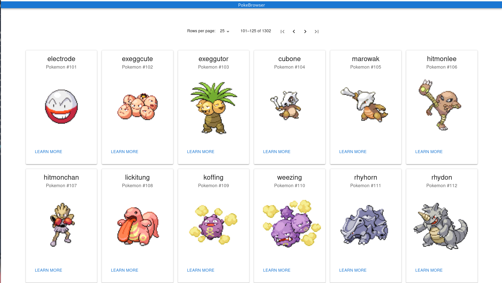

# PokeBrowser 
## Stack
- [@react](https://react.dev/) - frontend framework
- [@vitejs/plugin-react](https://github.com/vitejs/vite-plugin-react/blob/main/packages/plugin-react/README.md) uses [Babel](https://babeljs.io/) for Fast Refresh
- [@mui/material](https://mui.com/material-ui/getting-started/installation/) library for UI components

## Summary
This simple application displays data by referencing the https://pokeapi.co/ API, Then shows various pokemon as cards

## Screenshots


## How to run
In a terminal
``` 
    git clone https://github.com/dlstenbro/PokeBrowser
    npm install && npm run dev
```